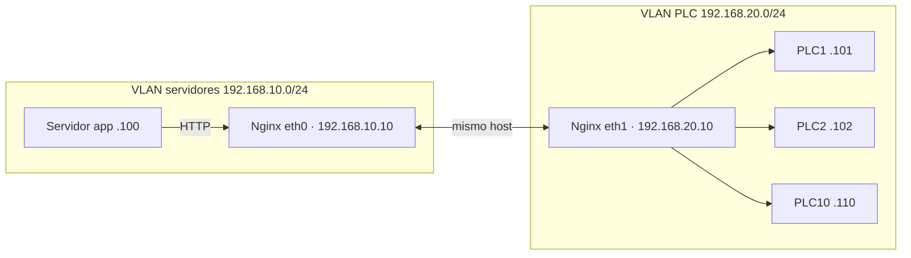

# Nginx como reverse proxy ante PLCs (HTTP y TCP)

Lectura complementaria: enlaza conceptos del curso (**VLAN**, **gateway**, **capa 4**, **NAT**) con un escenario industrial habitual — acceder a muchos PLCs desde una VLAN de servidores sin poner gateway en cada PLC.

**En el curso:** segmentación en [M08 — VLAN](../labs/M08/README.md), TCP/HTTP en [M04](../labs/M04/README.md), ausencia de ruta por defecto y reenvío en [M02 — puerta de enlace](../labs/M02/M02-02-puerta-enlace.md).

---

## Cuándo tiene sentido Nginx

Si los PLC exponen **HTTP/HTTPS** (página web de configuración, API REST, HMI embebida, etc.), puedes poner **Nginx** delante como **reverse proxy**: el servidor de aplicaciones habla con un único punto de entrada; Nginx reenvía hacia la IP real de cada PLC.

Nginx **no sustituye** a un gateway Modbus, OPC-UA ni al stack propietario del fabricante. Sirve para tráfico **HTTP/HTTPS** (y, con el módulo `stream`, reenvío **TCP** genérico).

---

## Topología de ejemplo

```text
VLAN SERVIDORES (192.168.10.0/24)
---------------------------------
Servidor aplicación     192.168.10.100

Nginx proxy (dos NICs)  192.168.10.10   ← VLAN servidores
                        192.168.20.10   ← VLAN PLC

VLAN PLC (192.168.20.0/24)
--------------------------
PLC1  192.168.20.101
PLC2  192.168.20.102
...
PLC10 192.168.20.110
```

Los **PLC no tienen gateway** (sin ruta por defecto). Solo conocen su propia subred.

**Nginx sí** tiene interfaz en **ambas** VLANs (o en la misma VLAN L2 que el PLC, ver más abajo). Así puede:

1. Recibir peticiones desde `192.168.10.100`.
2. Reenviarlas a `192.168.20.101` … `110` por la interfaz `192.168.20.10`.
3. Devolver la respuesta al cliente sin que el PLC enrute fuera de su segmento.



---

## Restricción clave: PLC sin gateway

**Sí: el proxy debe estar en la VLAN de los PLCs** (tener al menos una IP en `192.168.20.0/24` en el ejemplo). No basta con vivir solo en la VLAN de servidores.

Lo habitual es **dos interfaces** (o una NIC con dos VLAN):

```text
eth0  →  192.168.10.10   VLAN servidores   (los clientes hablan aquí)
eth1  →  192.168.20.10   VLAN PLC          (aquí reenvía hacia los autómatas)
```

Si el PLC tiene:

```text
IP:  192.168.20.101
GW:  (vacío)
```

solo responde a IPs que alcanza **en su misma subred** (L2). No puede mandar la respuesta a `192.168.10.x` porque no tiene ruta ni gateway.

| Configuración del proxy | ¿Funciona? |
|-------------------------|------------|
| `192.168.20.10` + `192.168.10.10` (en ambas VLAN) | **Sí** — patrón recomendado |
| Solo `192.168.20.10` (solo VLAN PLC) | **Sí** hacia los PLC, pero el servidor en `.10.x` debe llegar al proxy por otra vía (router, o también en VLAN PLC) |
| Solo `192.168.10.10` (solo VLAN servidores) | **No** — el PLC recibe petición con origen `.10.x` y **no puede responder** |

Flujo que sí funciona:

```text
App (.10.100) → Nginx (.10.10) → Nginx reenvía saliendo por .20.10 → PLC (.20.101)
PLC responde a .20.10 (misma VLAN) → Nginx devuelve la respuesta a .10.100
```

Sin IP `192.168.20.10` en el proxy, el PLC intentaría contestar a una IP de otra subred y el flujo se rompe.

---

## Opción 1 — Un nombre DNS por PLC

Cada PLC tiene un `server_name` distinto. El servidor resuelve `plc1.local`, `plc2.local`, etc.

```nginx
server {
    listen 80;
    server_name plc1.local;

    location / {
        proxy_pass http://192.168.20.101;
    }
}

server {
    listen 80;
    server_name plc2.local;

    location / {
        proxy_pass http://192.168.20.102;
    }
}

server {
    listen 80;
    server_name plc3.local;

    location / {
        proxy_pass http://192.168.20.103;
    }
}
```

*(Repite el bloque para `plc4` … `plc10` con `.104` … `.110`.)*

Acceso desde el servidor de aplicaciones:

```text
http://plc1.local
http://plc2.local
...
```

**Ventaja:** URLs limpias, un host virtual por equipo.  
**Inconveniente:** muchos bloques `server` si hay decenas de PLCs; hace falta DNS (o `/etc/hosts`) por nombre.

---

## Opción 2 — Un solo host y rutas por path

Un único `server_name`; cada PLC cuelga de un prefijo URL. Escala mejor con muchas máquinas.

```nginx
server {

    listen 80;
    server_name plcs.local;

    location /plc1/ {
        proxy_pass http://192.168.20.101/;
    }

    location /plc2/ {
        proxy_pass http://192.168.20.102/;
    }

    location /plc3/ {
        proxy_pass http://192.168.20.103/;
    }

    location /plc4/ {
        proxy_pass http://192.168.20.104/;
    }

    location /plc5/ {
        proxy_pass http://192.168.20.105/;
    }

    location /plc6/ {
        proxy_pass http://192.168.20.106/;
    }

    location /plc7/ {
        proxy_pass http://192.168.20.107/;
    }

    location /plc8/ {
        proxy_pass http://192.168.20.108/;
    }

    location /plc9/ {
        proxy_pass http://192.168.20.109/;
    }

    location /plc10/ {
        proxy_pass http://192.168.20.110/;
    }
}
```

Acceso:

```text
http://plcs.local/plc1/
http://plcs.local/plc2/
...
```

**Nota:** la barra final en `proxy_pass http://192.168.20.101/;` reescribe el path: `/plc1/foo` en el cliente puede llegar como `/foo` al PLC. Ajústalo si el firmware del PLC espera un path concreto.

**Ventaja:** un solo certificado TLS, un solo nombre en DNS.  
**Inconveniente:** algunas APIs REST del PLC pueden romperse si asumen estar en la raíz `/`.

---

## Opción 3 — TCP puro (Modbus y otros)

Si el PLC habla **Modbus/TCP** (puerto **502**), HTTP no aplica. Usa el bloque **`stream`** de Nginx (capa 4, sin parsear HTTP):

```nginx
stream {

    upstream plc1 {
        server 192.168.20.101:502;
    }

    upstream plc2 {
        server 192.168.20.102:502;
    }

    server {
        listen 15021;
        proxy_pass plc1;
    }

    server {
        listen 15022;
        proxy_pass plc2;
    }
}
```

La aplicación se conecta al proxy, no al PLC directamente:

```text
nginx:15021  →  PLC1:502
nginx:15022  →  PLC2:502
```

Misma lógica de red: Nginx debe poder alcanzar `192.168.20.x` por la interfaz correcta.

Para más de dos PLCs, amplía `upstream` y `listen` (15023, 15024, …) o valora **HAProxy** / reglas de firewall con DNAT si el volumen crece.

---

## HTTPS y cabeceras (producción)

En planta suele añadirse TLS en el proxy (certificado interno o de la CA de la empresa):

```nginx
server {
    listen 443 ssl;
    server_name plcs.local;

    ssl_certificate     /etc/nginx/certs/plcs.crt;
    ssl_certificate_key /etc/nginx/certs/plcs.key;

    location /plc1/ {
        proxy_pass http://192.168.20.101/;
        proxy_set_header Host $host;
        proxy_set_header X-Real-IP $remote_addr;
    }
}
```

El PLC sigue en HTTP interno; el cifrado termina en Nginx (patrón habitual en DMZ y VLAN de servidores — véase [M05 — DMZ](../labs/M05/M05-01-dmz.md)).

---

## Qué se usa en industria (más allá de Nginx)

| Necesidad | Herramienta habitual |
|-----------|----------------------|
| HTTP/HTTPS, APIs REST | **Nginx**, Traefik, Apache |
| TCP genérico, muchos puertos | **HAProxy**, iptables DNAT en firewall |
| Aislar VLAN OT/IT | Firewall industrial, reglas L3/L4 |
| Modbus, registros | Gateway **Modbus**, no Nginx HTTP |
| Siemens S7, tags | Gateway **OPC-UA** / middleware SCADA |
| EtherNet/IP (Allen-Bradley) | Gateway del ecosistema del fabricante |

Nginx encaja cuando el PLC (o el módulo web del autómata) ya habla **HTTP**. Para protocolos de campo (S7, Modbus serial/TCP nativo, Profinet, CIP) lo normal es un **gateway de protocolo**, no un reverse proxy web.

---

## Resumen

| Pregunta | Respuesta corta |
|----------|-----------------|
| ¿Puedo evitar gateway en cada PLC? | Sí, si el proxy tiene IP en la VLAN del PLC y el servidor entra por otra interfaz del proxy |
| ¿Un nombre por PLC o rutas `/plcN/`? | Nombres: más claro por equipo; rutas: más fácil de mantener con muchos |
| ¿Modbus en 502? | Módulo `stream` o HAProxy/NAT, no `location /` HTTP |
| ¿Relación con el curso? | VLAN ([M08](../labs/M08/README.md)), TCP ([M04](../labs/M04/README.md)), sin default route ([M02](../labs/M02/M02-02-puerta-enlace.md)) |

Para una arquitectura concreta (Siemens, Schneider, Omron, Allen-Bradley…) conviene cruzar **fabricante + protocolo** con el equipo de automatización; el patrón de red (proxy dual-homed, PLC sin GW) sigue siendo el mismo.
