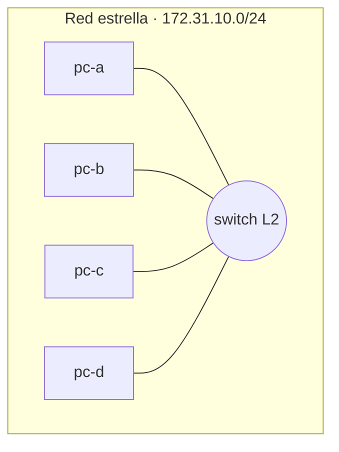
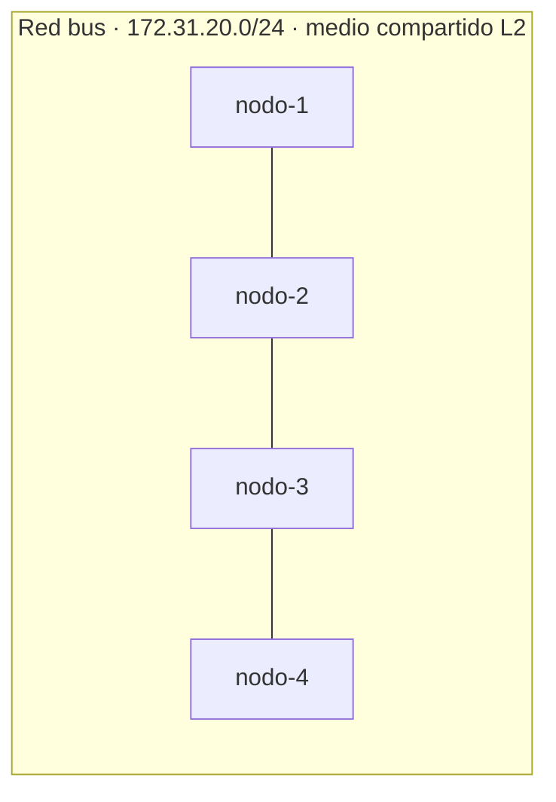
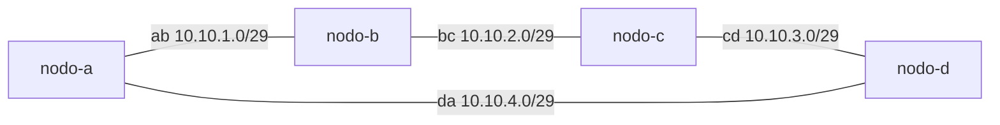
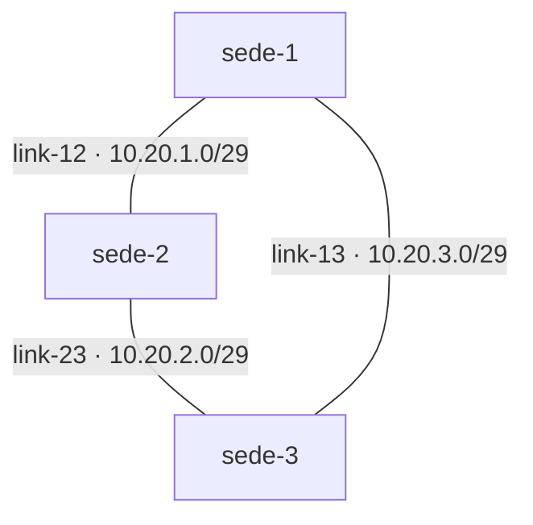
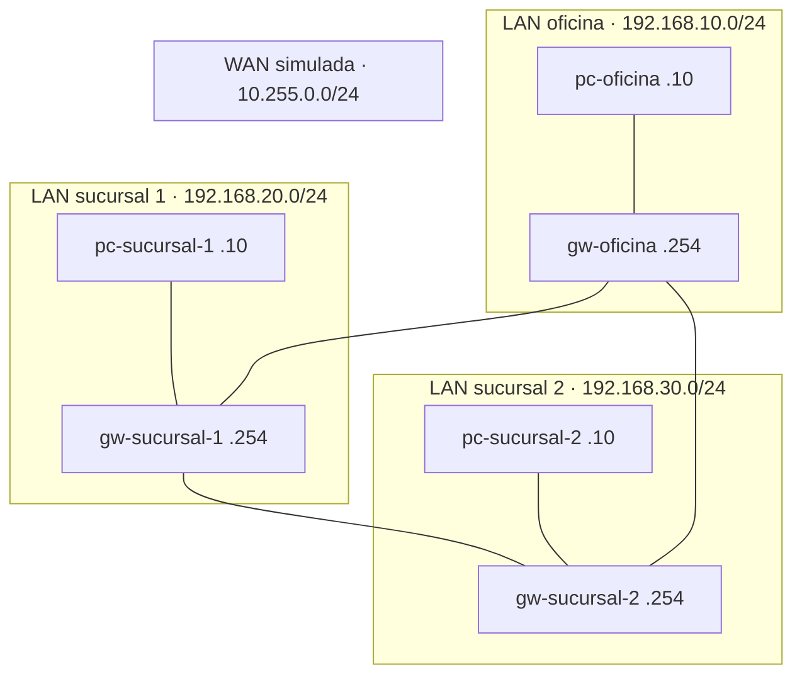

# Laboratorio M01-01 — Tipos de redes y topologías

[← Página anterior](README.md) · [Siguiente página →](M01-02-ip-publica-privada.md)

## Objetivo del laboratorio

Al terminar debes poder:

- Relacionar **estrella, bus, anillo y malla** con comportamiento real de conectividad (no solo el dibujo).
- Explicar qué cambia cuando **cae un nodo** o **se rompe un enlace**, y por qué.
- Clasificar tramos como **LAN o WAN** en un escenario con varias sedes.

Montarás cada topología con la maqueta del módulo. Antes de cada `docker compose up` verás **qué sistemas y redes se crean** (esquema + tabla). Tu trabajo es **levantarla, probarla y razonar sobre lo que ves**.

---

## Antes de empezar

**Aprende:** trabajas en **dos capas**:

1. **Codespace** — tu terminal y editor (el “taller”).
2. **Maqueta** — al hacer `docker compose up` se levantan **otros sistemas Linux** dentro del Codespace (PCs, routers), cada uno con su IP y sus interfaces. Entras con `docker compose exec -it <nombre> bash` y ahí ejecutas `ping`, `ip`, etc.

La imagen de esos sistemas es `lab-host:local` (se construye sola al crear el Codespace; ver [compose/README.md](compose/README.md)).  
Si necesitas definiciones (IP, interfaz, tabla de rutas, MAC…): [Glosario de términos](../../docs/glosario-terminos.md).

En todos los pasos: **levantar la maqueta** → **acceder al sistema** → comandos **dentro del sistema**. Desde la terminal del Codespace también paras o reinicias la maqueta y ejecutas los scripts de montaje.

### Dos sitios distintos (no mezcles comandos)

| Dónde estás | Prompt típico | Qué ejecutas aquí |
|-------------|---------------|-------------------|
| **Terminal del Codespace** | `usuario@…$` (ruta `…/compose/estrella`) | `docker compose up`, `exec`, `stop`, `down`, scripts `montar-*.sh` |
| **Dentro de un sistema** | `root@pc-a:/#` | `ip`, `ping`, `curl`… — **no** hay `docker` aquí |

Si ya hiciste `docker compose exec -it pc-a bash` y dentro intentas otra vez `docker compose exec…`, verás:

```text
bash: docker: command not found
```

No es un fallo del laboratorio: el PC simulado **no es** el Codespace; solo tiene herramientas de red. Para volver al “taller”, escribe `exit` y recuperarás el prompt del Codespace.

**Si falla:** la maqueta no arranca → usa **Codespace** (recomendado) o comprueba que tu entorno pueda ejecutar `docker compose`.

---

### Paso 1 — Topología en estrella

**Aprende:** en una estrella, los nodos no hablan entre sí directamente; dependen de un **punto central** (switch/hub). En la maqueta, ese centro es la red `estrella`.

**Haces:** levantar cuatro PCs en el mismo segmento y comprobar que se alcanzan por nombre (`pc-b`, `pc-d`).

#### Maqueta `compose/estrella` — qué levantas

| Qué aparece | Detalle |
|-------------|---------|
| **Sistemas** | 4 PCs: `pc-a`, `pc-b`, `pc-c`, `pc-d` |
| **Red** | Una sola: `estrella` → `172.31.10.0/24` |
| **Capa** | Solo **L2** (mismo segmento; sin router ni script) |
| **Comando** | `docker compose up -d` en `labs/M01/compose/estrella` |

Docker une los cuatro sistemas al mismo “switch” virtual. Cada PC recibe una IP automática en esa subred y resuelve los demás por nombre (`pc-b`, etc.).



**Levantar la maqueta:**

```bash
cd labs/M01/compose/estrella
docker compose up -d
```

**Acceder al sistema `pc-a`:**

```bash
docker compose exec -it pc-a bash
```

**Dentro del sistema `pc-a`:**

```bash
ip -4 addr show
ping -c 2 pc-b
ping -c 2 pc-d
```

**Deberías ver:**

- Una interfaz con IP en `172.31.10.0/24` (privada).
- `ping` con 0 % de pérdida hacia `pc-b` y `pc-d`.

#### Cómo leer `ip -4 addr show` (primera vez en el curso)

Salida típica dentro de `pc-a` (tu IP puede ser `.2`, `.3`, `.4`… — lo importante es el **patrón**):

```text
1: lo: <LOOPBACK,UP,LOWER_UP> …
    inet 127.0.0.1/8 scope host lo
2: eth0@if17: <BROADCAST,MULTICAST,UP,LOWER_UP> …
    inet 172.31.10.3/24 brd 172.31.10.255 scope global eth0
```

| Fragmento | Qué significa |
|-----------|----------------|
| `1: lo` | Interfaz **loopback** — tráfico “hacia uno mismo”. |
| `inet 127.0.0.1/8` | IP local; **no** sale a la LAN ni a internet. |
| `2: eth0` | Interfaz de **red** del sistema (la “NIC” de este PC en la maqueta). |
| `UP` | Interfaz **activa** (equivalente a “enchufada y encendida”). |
| `inet 172.31.10.3/24` | **IPv4 del PC** en la red estrella + **prefijo** `/24` (máscara `255.255.255.0`). |
| `brd 172.31.10.255` | Dirección de **broadcast** de esa subred (mensajes a “todos” en el segmento). |
| `scope global` | Esta IP se usa para hablar con **otros hosts** de la red. |

**Comprueba:** la IP debe caer en `172.31.10.0/24` (privada RFC1918). Si ves solo `lo` y no `eth0` con `inet`, el sistema no está bien unido a la red de la maqueta.

#### Cómo leer `ping` (misma LAN)

```text
PING pc-b (172.31.10.4) 56(84) bytes of data.
64 bytes from pc-b (172.31.10.4): icmp_seq=1 ttl=64 time=0.05 ms
64 bytes from pc-b (172.31.10.4): icmp_seq=2 ttl=64 time=0.04 ms
--- pc-b ping statistics ---
2 packets transmitted, 2 received, 0% packet loss, time 1001ms
```

| Fragmento | Qué significa |
|-----------|----------------|
| `PING pc-b (172.31.10.4)` | Resolvió el **nombre** `pc-b` a una IP (DNS interno de Docker en la maqueta). |
| `icmp_seq=1` | Número de secuencia del eco ICMP (cada `ping` enviado). |
| `ttl=64` | *Time to live*: en la **misma LAN** suele quedarse en **64** (no ha pasado por routers). |
| `time=0.05 ms` | Latencia; en la maqueta es casi instantánea. |
| `0% packet loss` | **Conectividad OK** entre los dos sistemas. |

**Por qué:** al estar en la **misma red L2**, no hace falta router: el switch de la maqueta reenvía tramas entre equipos como en una LAN.

**Haces (fallo de nodo):** deja abierta la sesión en `pc-a` (o vuelve a entrar con `docker compose exec -it pc-a bash`). En **otra terminal** (Codespace, fuera del sistema) apaga un extremo:

**En tu terminal (maqueta):**

```bash
docker compose stop pc-c
```

**Dentro del sistema `pc-a`:**

```bash
ping -c 2 pc-b
ping -c 2 pc-c
```

**Deberías ver:**

- `pc-a` → `pc-b`: **sigue funcionando** (el tercero caído no bloquea a los demás en L2).
- `pc-a` → `pc-c`: **no responde** (el nodo está parado).

#### Cómo leer `ping` cuando un nodo está parado

Hacia `pc-b` (activo): igual que antes — `0% packet loss`.

Hacia `pc-c` (parado con `docker compose stop` en el **Codespace**), suele aparecer algo como:

```text
2 packets transmitted, 0 received, 100% packet loss
```

o tras varios intentos `Destination Host Unreachable`. **Interpretación:** no hay proceso respondiendo en ese “PC”; el switch no puede entregar el tráfico al destino. No confundas esto con “no tengo internet”: aquí el fallo es **ese host concreto**.

**Por qué:** en estrella L2, la caída de **un extremo** aísla solo a ese nodo; el centro de la maqueta sigue activo. En la vida real, si cae el **switch central**, caerían todos; en este paso no apagamos ese centro.

**En tu terminal (maqueta):**

```bash
docker compose start pc-c
docker compose down
```

---

### Paso 2 — Topología en bus (medio compartido)

**Aprende:** en un bus clásico, todos comparten **un mismo medio**; un fallo en el cable troncal puede partir la red en dos. En la maqueta no hay cable físico, pero sí un **único dominio de broadcast** — a nivel L2 el comportamiento es parecido al de la estrella de este laboratorio.

**Haces:** misma prueba de conectividad y misma caída de un nodo intermedio.

#### Maqueta `compose/bus` — qué levantas

| Qué aparece | Detalle |
|-------------|---------|
| **Sistemas** | 4 nodos: `nodo-1` … `nodo-4` |
| **Red** | Una sola: `bus` → `172.31.20.0/24` |
| **Capa** | Solo **L2** (medio compartido emulado; sin router) |
| **Comando** | `docker compose up -d` en `labs/M01/compose/bus` |

Conceptualmente es un bus; técnicamente Docker los pone en el mismo segmento L2 (como la estrella). El ejercicio contrasta el **significado de diseño** (riesgo del medio único) con la prueba de ping.



**Levantar la maqueta:**

```bash
cd ../bus
docker compose up -d
```

**Acceder al sistema `nodo-1`:**

```bash
docker compose exec -it nodo-1 bash
```

**Dentro del sistema `nodo-1`:**

```bash
ping -c 2 nodo-4
```

**En tu terminal (maqueta):** `docker compose stop nodo-2`

**Dentro del sistema `nodo-1`:**

```bash
ping -c 2 nodo-4
exit
```

**En tu terminal (maqueta):** `docker compose down`

**Deberías ver:** con `nodo-2` parado, `nodo-1` **sigue llegando a `nodo-4`** (en este emulador L2) — mismo criterio que en el paso 1: `0% packet loss` si el destino está arriba.

**Repaso:** si el `ping` falla, mira **estadísticas finales** (`packet loss`) y confirma en qué terminal ejecutaste `stop` (debe ser el Codespace, no dentro del nodo).

**Por qué:** la maqueta une todos los equipos al mismo segmento L2; apagar un sistema no “corta el bus” entre los demás. En un bus **físico** antiguo, un corte en el tramo central sí dejaría sin comunicación a varios equipos — esa diferencia es importante: **la maqueta enseña L2 compartido; el dibujo de bus enseña el riesgo del medio único en cable coaxial/Ethernet viejo**.

**Contraste con el paso 1:** misma observación en ping, distinto **significado en diseño**: estrella concentra fallos en el centro; bus concentra fallos en el **medio**.

---

### Paso 3 — Topología en anillo

**Aprende:** en un anillo, el tráfico entre nodos no vecinos debe **atravesar intermediarios** (capa 3 o reenvío). Por eso hace falta **enrutamiento** además de cables lógicos.

**Haces:** levantar cuatro nodos, cada uno en **dos redes** (dos interfaces), y aplicar rutas con el script.

#### Maqueta `compose/anillo` — qué levantas

| Qué aparece | Detalle |
|-------------|---------|
| **Sistemas** | 4 routers/nodos: `nodo-a` … `nodo-d` (cada uno con **2 interfaces**) |
| **Redes** | 4 segmentos punto a punto: `ab`, `bc`, `cd`, `da` (`10.10.x.0/29`) |
| **Capa** | **L3** — `ip_forward=1` en cada nodo; rutas con `./montar-rutas.sh` |
| **Comandos** | `docker compose up -d` y luego `./montar-rutas.sh` |

Cada enlace del anillo es una red Docker distinta. Un paquete de `nodo-a` a `nodo-c` no va directo: pasa por `nodo-b` (y sus tablas de rutas).



Cada flecha es una **red distinta**; `nodo-b`, `nodo-c`, etc. tienen **dos interfaces** (una por tramo).

**Levantar la maqueta:**

```bash
cd ../anillo
docker compose up -d
./montar-rutas.sh
```

**Acceder al sistema `nodo-a`:**

```bash
docker compose exec -it nodo-a bash
```

**Dentro del sistema `nodo-a`:**

```bash
ping -c 2 10.10.2.3
```

**Deberías ver:** respuesta desde `10.10.2.3` (es `nodo-c`), con TTL 63 o similar (cruza saltos).

#### Cómo leer `ping` entre subredes (primer router en el curso)

```text
64 bytes from 10.10.2.3: icmp_seq=1 ttl=63 time=0.2 ms
```

| Dato | Qué significa |
|------|----------------|
| `from 10.10.2.3` | Respondió la IP de destino (aquí, `nodo-c` en el tramo `bc`). |
| `ttl=63` (no 64) | El paquete **pasó por al menos un router** (`nodo-b` reenvía: TTL baja en cada salto L3). |
| `time` un poco mayor | Normal al cruzar más de un sistema. |

Dentro de `nodo-a`, `ip -4 addr show` debería mostrar **dos bloques** `inet` en interfaces distintas (p. ej. `eth0` y `eth1`) — una por cada tramo del anillo al que está unido.

**Por qué:** `nodo-a` no está en el mismo segmento L2 que `nodo-c`; el paquete va **a → b → c** (o al revés) gracias a `ip_forward` y las rutas estáticas del script.

**Haces (romper el anillo):** quita a `nodo-b` del segmento `bc` — es como cortar un tramo del anillo:

**En tu terminal (maqueta):**

```bash
docker network disconnect anillo_bc nodo-b
```

**Dentro del sistema `nodo-a`** (misma sesión o vuelve a entrar con `exec`):

```bash
ping -c 2 10.10.2.3
```

**Deberías ver:** el `ping` **deja de funcionar** (timeout o unreachable).

**Interpretación:** antes había camino `a → b → c` (TTL 63); al desconectar `nodo-b` del segmento `bc`, se rompe el **anillo L3** — no es lo mismo que apagar un PC en una LAN plana (paso 1). Aquí falla la **ruta entre subredes**.

**Por qué:** sin `nodo-b` en `bc`, no hay camino L3 entre el tramo `ab` y el tramo `bc`. El anillo deja de ser cerrado.

**Haces (restaurar):**

**En tu terminal (maqueta):**

```bash
docker network connect anillo_bc nodo-b
./montar-rutas.sh
docker compose down
```

---

### Paso 4 — Malla parcial (triángulo)

**Aprende:** una malla tiene **varios caminos** entre nodos; si uno falla, otro puede servir (si las rutas lo permiten). Aquí hay tres sedes y tres enlaces — un triángulo.

**Haces:** comprobar que hay caminos alternativos en el dibujo, pero que cada nodo usa **una** ruta según su tabla.

#### Maqueta `compose/malla` — qué levantas

| Qué aparece | Detalle |
|-------------|---------|
| **Sistemas** | 3 routers: `sede-1`, `sede-2`, `sede-3` (cada uno con **2 interfaces**) |
| **Redes** | 3 enlaces: `link-12`, `link-23`, `link-13` (`10.20.x.0/29`) |
| **Capa** | **L3** — reenvío IP + `./montar-rutas.sh` |
| **Comandos** | `docker compose up -d` y luego `./montar-rutas.sh` |

Forma un triángulo: entre `sede-1` y `sede-3` existen dos rutas posibles en el dibujo (`sede-2` por un lado o el otro), pero `ip route get` mostrará **un** siguiente salto según lo configurado.



**Levantar la maqueta:**

```bash
cd ../malla
docker compose up -d
./montar-rutas.sh
```

**Acceder al sistema `sede-1`:**

```bash
docker compose exec -it sede-1 bash
```

**Dentro del sistema `sede-1`:**

```bash
ping -c 2 10.20.2.3
ip route get 10.20.2.3
exit
```

**En tu terminal (maqueta):** `docker compose down`

**Deberías ver:**

- Ping correcto hacia `sede-3` (`10.20.2.3`).
- `ip route get` muestra **un** siguiente salto (p. ej. vía `10.20.1.3` = `sede-2`), según las rutas que instaló el script.

#### Cómo leer `ip route get`

Ejemplo:

```text
10.20.2.3 via 10.20.1.3 dev eth0 src 10.20.1.2 uid 0
```

| Campo | Qué significa |
|-------|----------------|
| `10.20.2.3` | Destino que preguntas. |
| `via 10.20.1.3` | **Siguiente salto** (IP del router vecino en este tramo — aquí `sede-2`). |
| `dev eth0` | Interfaz por la que **saldrá** el paquete. |
| `src 10.20.1.2` | IP origen que usará este sistema (`sede-1`). |

**Repaso TTL:** si el ping a `10.20.2.3` muestra `ttl=63`, confirma que no es un vecino L2 directo: hay **reenvío** en el camino.

**Por qué:** aunque existan caminos alternativos en el dibujo, cada nodo usa la **tabla de rutas que tiene configurada**. La malla “de verdad” en producción reparte o conmuta por varios enlaces; en este 101 ves que **tener cables de más no basta sin rutas o protocolos que los usen**.

---

### Paso 5 — LAN, WAN y sedes (empresa)

**Aprende:** clasificar redes por **alcance y quién las administra**, no por el protocolo. Una LAN es un dominio local (oficina, sucursal); una WAN une sitios lejanos (aquí simulamos MPLS con la red `wan-mpls`).

**Haces:** levantar oficina + dos sucursales + routers; comprobar reachability entre sedes.

#### Maqueta `compose/empresa` — qué levantas

| Qué aparece | Detalle |
|-------------|---------|
| **Sistemas** | 3 PCs (`pc-oficina`, `pc-sucursal-1`, `pc-sucursal-2`) + 3 gateways (`gw-oficina`, `gw-sucursal-1`, `gw-sucursal-2`) |
| **LANs** | `lan-oficina` `192.168.10.0/24`, `lan-sucursal-1` `192.168.20.0/24`, `lan-sucursal-2` `192.168.30.0/24` |
| **WAN simulada** | `wan-mpls` `10.255.0.0/24` — solo enlaza los tres `gw-*` |
| **Capa** | **L3** — cada `gw-*` tiene 2 interfaces; `./montar-rutas.sh` instala rutas |
| **Comandos** | `docker compose up -d` y luego `./montar-rutas.sh` |

El tráfico entre oficina y sucursal 2 sale de su LAN, cruza la WAN simulada por los routers y entra en la otra LAN.



**Levantar la maqueta:**

```bash
cd ../empresa
docker compose up -d
./montar-rutas.sh
```

**Acceder al sistema `pc-oficina`:**

```bash
docker compose exec -it pc-oficina bash
```

**Dentro del sistema `pc-oficina`:**

```bash
ping -c 2 192.168.30.10
exit
```

**Deberías ver:** ping OK desde la oficina al PC de sucursal 2 (`192.168.30.10`), TTL bajando (atraviesa gateways).

#### Cómo leer este `ping` (LAN → WAN → LAN)

```text
64 bytes from 192.168.30.10: icmp_seq=1 ttl=62 time=0.3 ms
```

| Dato | Qué significa |
|------|----------------|
| Origen `192.168.10.10` / destino `192.168.30.10` | **Subredes distintas** (tercer octeto cambia: `.10` vs `.30`). |
| `ttl=62` (o 61) | Han cruzado **varios routers** (`gw-oficina`, `gw-sucursal-2`…); cada salto L3 resta 1 al TTL. |
| `0% packet loss` | La ruta entre sedes está bien montada (`montar-rutas.sh` + `ip_forward`). |

En `pc-oficina`, `ip route show default` debería apuntar al gateway de su LAN (`192.168.10.254` = `gw-oficina`).

**Por qué:** cada `lan-*` es una LAN distinta (subred privada). Los `gw-*` tienen **dos interfaces**: una en su LAN y otra en `wan-mpls`. El tráfico entre `192.168.10.0/24` y `192.168.30.0/24` sale de la LAN, entra en la WAN simulada y entra en la otra LAN.

Completa la tabla (no hay una sola respuesta “de libro” en la última columna; debe ser **coherente**):

| Red (maqueta) | Tipo (LAN / WAN) | ¿Por qué? |
|------------|------------------|-----------|
| `lan-oficina` | | |
| `lan-sucursal-1` | | |
| `lan-sucursal-2` | | |
| `wan-mpls` | | |

**Pistas para razonar:**

- Las tres `lan-*` son redes locales de cada sitio (RFC1918, ámbito limitado).
- `wan-mpls` no es la LAN de usuarios: es el **transporte entre routers** (en producción: operador/MPLS; aquí: la red WAN simulada).

**En tu terminal (maqueta):** `docker compose down`

---

## Antes de seguir

### Pon el foco en

- **Topología** = quién conecta con quién y qué pasa cuando algo se rompe, no solo la forma del dibujo.
- **L2** (un solo segmento): `ping` por nombre, sin rutas extra.
- **L3** (anillo, malla, empresa): hace falta **router** (`ip_forward` + rutas).

### Reto

**1. Quinto equipo en la estrella** — Añade el sistema `pc-e` a la red estrella (misma idea que `pc-a`…`pc-d`) y comprueba que el resto le hace `ping`.

<details>
<summary>Ver solución</summary>

Edita `labs/M01/compose/estrella/docker-compose.yaml` y añade:

```yaml
  pc-e:
    image: lab-host:local
    hostname: pc-e
    networks:
      estrella:
```

**Levantar la maqueta:** `cd labs/M01/compose/estrella` y `docker compose up -d`

**Acceder a `pc-a`:** `docker compose exec -it pc-a bash`

**Dentro de `pc-a`:** `ping -c 2 pc-e`

Misma red L2: no hace falta script de rutas. Si falla el nombre, accede a `pc-e`, mira la IP con `ip -4 addr show`, vuelve a `pc-a` y haz ping por IP.

</details>

**2. Nuevo puesto en la oficina** — En la maqueta `empresa`, añade un PC en `lan-oficina` con IP `192.168.10.50` y haz que la oficina central llegue a una sucursal **desde ese PC nuevo** (no solo desde `pc-oficina`).

<details>
<summary>Ver solución</summary>

En `labs/M01/compose/empresa/docker-compose.yaml`:

```yaml
  pc-inventario:
    image: lab-host:local
    hostname: pc-inventario
    cap_add:
      - NET_ADMIN
    networks:
      lan-oficina:
        ipv4_address: 192.168.10.50
```

**Levantar la maqueta:** `cd labs/M01/compose/empresa`, `docker compose up -d`, `./montar-rutas.sh`

**Acceder a `pc-inventario`:** `docker compose exec -it pc-inventario bash`

**Dentro de `pc-inventario`:**

```bash
ip route replace default via 192.168.10.254
ping -c 2 192.168.30.10
```

Usas el mismo gateway y rutas que ya configuró `montar-rutas.sh` para el resto de la sede.

</details>

**3. Cerrar el anillo otra vez** — Con el anillo levantado, repite el corte (`disconnect` de `nodo-b` en `anillo_bc`), confirma que cae el `ping` de `nodo-a` a `10.10.2.3`, y **restaura** la conectividad sin recrear el compose.

<details>
<summary>Ver solución</summary>

**Levantar la maqueta:** `cd labs/M01/compose/anillo`, `up -d`, `./montar-rutas.sh`

**Acceder a `nodo-a`:** `docker compose exec -it nodo-a bash`

**Dentro de `nodo-a`:** `ping -c 2 10.10.2.3` (debe funcionar)

**Maqueta:** `docker network disconnect anillo_bc nodo-b`

**Dentro de `nodo-a`:** `ping -c 2 10.10.2.3` (debe fallar)

**Maqueta:** `docker network connect anillo_bc nodo-b`, `./montar-rutas.sh`

**Dentro de `nodo-a`:** `ping -c 2 10.10.2.3` (debe volver)

**Maqueta:** `docker compose down`

</details>
