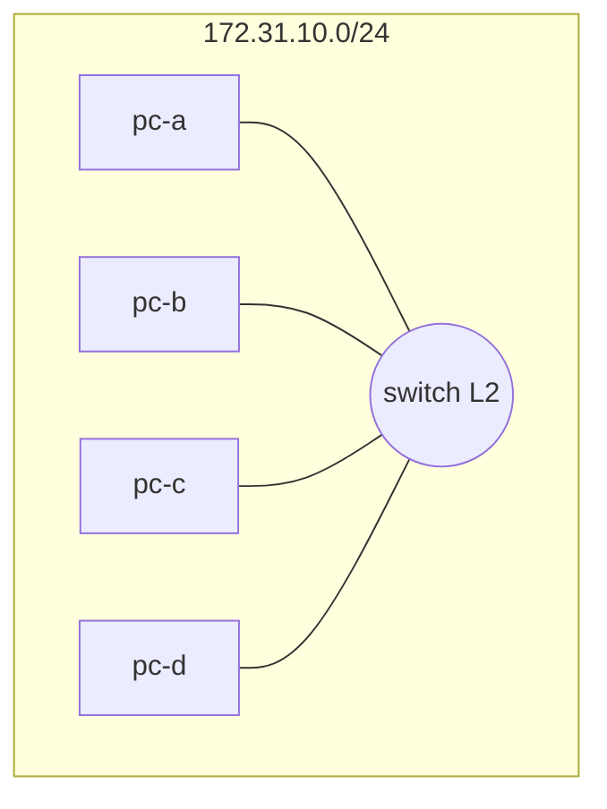
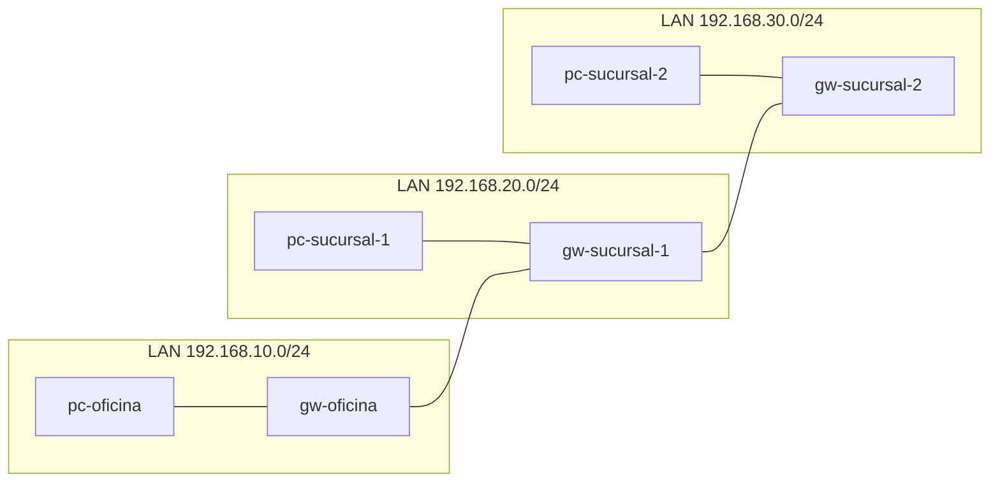

# Laboratorio M01-02 — IP pública y privada

[← Página anterior](M01-01-tipos-redes-topologias.md) · [Siguiente página →](M01-03-nat-pat.md)

## Objetivo del laboratorio

Al terminar debes poder:

- Reconocer direcciones **RFC1918** (privadas) en una interfaz.
- Explicar por qué la IP del sistema en la maqueta **no es** la que internet ve cuando tú navegas desde el Codespace.
- Argumentar por qué el mismo rango privado puede repetirse en millones de LAN distintas.

En cada paso: **levantar la maqueta** → **acceder al sistema** (`docker compose exec -it … bash`) → comandos **dentro del sistema**. El `curl ifconfig.me` del paso 3 va en tu **terminal del Codespace** (fuera de la maqueta).

---

### Paso 1 — IP privada dentro de la LAN simulada

**Aprende:** dentro de una LAN, los equipos usan direcciones **privadas** (no enrutables globalmente en internet). Cada PC de la maqueta es un sistema más en esa LAN.

**Haces:** leer la configuración IP en `pc-a` de la topología estrella.

#### Maqueta `compose/estrella` — qué levantas

| Qué aparece | Detalle |
|-------------|---------|
| **Sistemas** | `pc-a`, `pc-b`, `pc-c`, `pc-d` |
| **Red** | `estrella` → `172.31.10.0/24` |
| **Capa** | Solo **L2** (sin router) |



**Levantar la maqueta:**

```bash
cd labs/M01/compose/estrella
docker compose up -d
```

**Acceder al sistema `pc-a`:**

```bash
docker compose exec -it pc-a bash
```

**Dentro del sistema `pc-a`:**

```bash
ip -4 addr show
ip route show default
```

**Deberías ver:**

- Una dirección en `172.31.10.0/24` (rango privado).
- Puede **no haber** ruta por defecto — en estrella L2 puro a veces solo hay red local.

**Cómo interpretarlo:** busca la línea `inet …/24` bajo `eth0` (no confundir con `lo` / `127.0.0.1`). Guía campo a campo en [M01-01 paso 1](M01-01-tipos-redes-topologias.md) (sección *Cómo leer `ip -4 addr show`*).

**Por qué:** la maqueta asigna IP privada a cada sistema en la red `estrella`. Esa IP solo vale **dentro** de esa LAN simulada; ningún router de internet la conoce.

Anota: dirección, prefijo CIDR y si cae en `10.0.0.0/8`, `172.16.0.0/12` o `192.168.0.0/16`.

**Dentro del sistema:** `exit`

**En tu terminal (maqueta):** `docker compose down`

---

### Paso 2 — IP de tu puesto (Codespace)

**Aprende:** el entorno donde escribes comandos (Codespace) también tiene interfaces con IP; suelen ser **privadas** hacia la red del proveedor y **otra IP pública** para salir a internet (paso 3).

**Haces:** en tu **terminal del Codespace**, sin entrar en ningún sistema de la maqueta:

```bash
ip -4 addr show
ip route show default
```

**Deberías ver:**

- Una o más interfaces con IP (a menudo `eth0`, etc.).
- Muchas veces una IP en `10.x` o `192.168.x` (privada del datacenter o detrás de NAT del cloud).
- Ruta `default via …` hacia un gateway.

**Por qué:** tu Codespace es un equipo real en una red administrada por el proveedor. No es “internet”; es otra LAN o red de infraestructura. Marca cada IPv4 como **privada (RFC1918)** o **pública**.

---

### Paso 3 — La IP que internet ve (salida)

**Aprende:** la **IP pública de salida** es la que aparece cuando el tráfico ya ha pasado por NAT del proveedor o del router.

**Haces:** en tu **terminal del Codespace** (no dentro de `pc-a`):

```bash
curl -s ifconfig.me
echo
```

**Deberías ver:** una dirección que **no** coincide con la IP de `pc-a` del paso 1 (`172.31.10.x`).

**Por qué:**

| Dónde | IP típica | ¿La ve internet como “tú”? |
|-------|-----------|----------------------------|
| Sistema `pc-a` (maqueta) | `172.31.10.x` | No — LAN aislada de la maqueta |
| Tu Codespace | Privada + NAT del cloud | La pública del paso 3 sí |

El `curl` sale desde **tu puesto**, no desde `pc-a`. Por eso M01-03 montará NAT **dentro** de la maqueta para que los clientes simulados “salgan” a la red `internet`.

---

### Paso 4 — Varias LAN con el mismo esquema de direcciones

**Aprende:** el mismo rango privado puede repetirse en empresas distintas sin conflicto hasta que se **unan** redes sin NAT.

**Haces:** comparar un PC y un router en la maqueta `empresa`.

#### Maqueta `compose/empresa` — qué levantas

| Qué aparece | Detalle |
|-------------|---------|
| **Sistemas** | 3 PCs + 3 gateways (`gw-oficina`, `gw-sucursal-1`, `gw-sucursal-2`) |
| **LANs** | `192.168.10/20/30.0/24` (oficina y dos sucursales) |
| **WAN** | `wan-mpls` `10.255.0.0/24` entre los `gw-*` |
| **Script** | `./montar-rutas.sh` tras `up -d` |



**Levantar la maqueta:**

```bash
cd labs/M01/compose/empresa
docker compose up -d
./montar-rutas.sh
```

**Acceder al sistema `pc-sucursal-1`:**

```bash
docker compose exec -it pc-sucursal-1 bash
```

**Dentro del sistema `pc-sucursal-1`:** `ip -4 addr show` — anota la IP. `exit`

**Acceder al sistema `gw-oficina`:**

```bash
docker compose exec -it gw-oficina bash
```

**Dentro del sistema `gw-oficina`:** `ip -4 addr show` — debes ver **dos** interfaces con IP. `exit`

**Deberías ver:**

- `pc-sucursal-1`: una IP en `192.168.20.0/24`.
- `gw-oficina`: `192.168.10.254` y `10.255.0.11` (LAN + WAN simulada).

**Por qué:** el gateway es el límite entre dominios: una IP hacia la LAN, otra hacia la WAN de la maqueta.

**En tu terminal (maqueta):** `docker compose down`

---

## Antes de seguir

### Pon el foco en

- **Privada** = única y válida dentro de un dominio (LAN); no se anuncia a internet global.
- **Pública** = enrutable globalmente; en hogar/oficina casi siempre hay **pocas** públicas y muchas privadas detrás de NAT.

### Reto

**1. Otro host privado en la estrella** — Añade `pc-e`, mira su IPv4 **dentro del sistema** y compárala con `curl -s ifconfig.me` en tu terminal del Codespace.

<details>
<summary>Ver solución</summary>

Mismo bloque `pc-e` que en M01-01 (reto estrella).

**Levantar la maqueta:** `cd labs/M01/compose/estrella` → `docker compose up -d`

**Acceder a `pc-e`:** `docker compose exec -it pc-e bash`

**Dentro de `pc-e`:** `ip -4 addr show`

**En tu terminal (Codespace):** `curl -s ifconfig.me; echo`

La IP del sistema estará en `172.31.10.0/24`; la del `curl` es la de salida del cloud.

</details>

**2. Equipo nuevo en sucursal 1** — En `empresa`, añade `pc-nuevo` (`192.168.20.25`). Desde `pc-oficina`, haz `ping` a ese equipo.

<details>
<summary>Ver solución</summary>

Añade `pc-nuevo` en `docker-compose.yaml` de `empresa` (IP `192.168.20.25` en `lan-sucursal-1`).

**Levantar la maqueta:** `up -d` y `./montar-rutas.sh`

**Acceder a `pc-oficina`:** `docker compose exec -it pc-oficina bash`

**Dentro de `pc-oficina`:** `ping -c 2 192.168.20.25`

</details>
