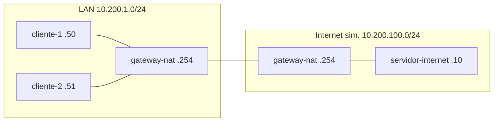

# Laboratorio M01-03 — NAT estático, dinámico y PAT

[← Página anterior](M01-02-ip-publica-privada.md) · [Siguiente página →](../M02/README.md)

## Objetivo del laboratorio

Al terminar debes poder:

- Diferenciar **PAT** (muchos internos, una IP pública) de **port forwarding** (NAT estático de puerto).
- Explicar qué hace el gateway cuando dos clientes salen a la vez hacia el mismo destino.
- Relacionar la maqueta con lo que viste en M01-02 (`ifconfig.me` vs IP del sistema en la LAN).

En cada paso: **levantar la maqueta** (y scripts en tu terminal) → **acceder al sistema** → operar **dentro del entorno** de ese equipo.

---

## Mapa mental (antes de tocar comandos)

```text
LAN interna (10.200.1.0/24)          Red "internet" (10.200.100.0/24)
  cliente-1, cliente-2  ──────►  gateway-nat  ──────►  servidor-internet
                              (traduce IP:puerto)
```

- **PAT:** al salir, varios `10.200.1.x` se mascarán como la IP del gateway en la red externa (`10.200.100.254`).
- **Estático de puerto:** tráfico entrante a `10.200.100.254:8080` se redirige a un servicio interno concreto.

---

### Paso 1 — PAT: varios clientes, una salida

**Aprende:** el **PAT** (NAT sobrecarga) es el modo habitual en hogar y oficinas: todos comparten **una** IP hacia fuera y se distinguen por **puerto** traducido.

#### Maqueta `compose/nat-pat` — qué levantas

| Qué aparece | Detalle |
|-------------|---------|
| **Sistemas** | `cliente-1`, `cliente-2`, `gateway-nat`, `servidor-internet` |
| **LAN interna** | `10.200.1.0/24` — clientes `.50`, `.51`; gateway `.254` |
| **Internet simulada** | `10.200.100.0/24` — servidor `.10`; gateway `.254` |
| **Script** | `./montar-nat.sh` (rutas + MASQUERADE en `gateway-nat`) |



**Levantar la maqueta:**

```bash
cd labs/M01/compose/nat-pat
docker compose up -d
./montar-nat.sh
```

El script prepara rutas y MASQUERADE en el gateway (opcional: `cat montar-nat.sh`).

**Acceder al sistema `cliente-1`:**

```bash
docker compose exec -it cliente-1 bash
```

**Dentro del sistema `cliente-1`:**

```bash
ping -c 2 10.200.100.10
exit
```

**Acceder al sistema `cliente-2`:**

```bash
docker compose exec -it cliente-2 bash
```

**Dentro del sistema `cliente-2`:** `ping -c 2 10.200.100.10` — luego `exit`.

**Deberías ver:** ambos pings con respuesta desde `servidor-internet`.

**Por qué:** el paquete sale por el gateway; este reescribe la IP origen a `10.200.100.254`. El servidor ve al gateway, no la IP privada del cliente.

---

### Paso 2 — Observar la traducción

**Aprende:** la “tabla de traducción” es estado en el router (`conntrack` + NAT) que recuerda **quién pidió qué**.

**Acceder al sistema `cliente-1`:**

```bash
docker compose exec -it cliente-1 bash
```

**Dentro del sistema `cliente-1`:**

```bash
ping -c 3 10.200.100.10
exit
```

**Acceder al sistema `gateway-nat`:**

```bash
docker compose exec -it gateway-nat bash
```

**Dentro del sistema `gateway-nat`:**

```bash
iptables -t nat -L POSTROUTING -n -v
conntrack -L 2>/dev/null | head -20
exit
```

**Deberías ver:** regla `MASQUERADE` con contadores; entradas en `conntrack` si está disponible.

Completa:

| IP interna | IP que ve el destino | Rol |
|------------|----------------------|-----|
| 10.200.1.50 | 10.200.100.254 | Cliente 1 tras PAT |
| 10.200.1.51 | | Cliente 2 tras PAT |

---

### Paso 3 — Dos clientes a la vez

**Aprende:** el gateway distingue flujos por **puerto traducido** cuando comparten IP pública.

**Acceder a `cliente-1`:**

```bash
docker compose exec -it cliente-1 bash
```

**Dentro del sistema `cliente-1`:**

```bash
ping -c 1 10.200.100.10 &
ping -c 1 10.200.100.10
exit
```

**Acceder a `cliente-2`:**

```bash
docker compose exec -it cliente-2 bash
```

**Dentro del sistema `cliente-2`:** `ping -c 1 10.200.100.10` — `exit`

**Acceder a `gateway-nat`:**

```bash
docker compose exec -it gateway-nat bash
```

**Dentro del sistema `gateway-nat`:**

```bash
conntrack -L 2>/dev/null | grep 10.200.100.10
iptables -t nat -L -n -v
exit
```

---

### Paso 4 — NAT estático de puerto (port forwarding)

**Aprende:** para que alguien **desde fuera** inicie conexión hacia un servicio interno, configuras **DNAT** en el gateway.

**Haces:** tres sesiones separadas (tres accesos `exec … bash`).

**Sesión 1 — sistema `cliente-1`** (servicio escuchando):

```bash
docker compose exec -it cliente-1 bash
```

**Dentro del entorno:**

```bash
nc -l -p 8080
```

(deja esta sesión esperando)

**Sesión 2 — sistema `gateway-nat`:**

```bash
docker compose exec -it gateway-nat bash
```

**Dentro del entorno:**

```bash
iptables -t nat -A PREROUTING -d 10.200.100.254 -p tcp --dport 8080 \
  -j DNAT --to-destination 10.200.1.50:8080
```

**Sesión 3 — sistema `servidor-internet`:**

```bash
docker compose exec -it servidor-internet bash
```

**Dentro del entorno:**

```bash
echo hola | nc -w 2 10.200.100.254 8080
```

**Deberías ver:** en la sesión 1, el texto `hola`.

---

### Paso 5 — Cerrar el círculo con M01-02

**Aprende:** tu Codespace hace PAT hacia internet real; la maqueta lo reproduce entre sus redes.

**En tu terminal (Codespace):**

```bash
curl -s ifconfig.me; echo
```

**Acceder al sistema `cliente-1`:**

```bash
docker compose exec -it cliente-1 bash
```

**Dentro del sistema `cliente-1`:** `ip -4 addr show eth0` — `exit`

**Deberías ver:** IP pública del Codespace ≠ `10.200.1.50`.

**En tu terminal (maqueta):** `docker compose down`

---

## Antes de seguir

### Pon el foco en

| Tipo | Dirección típica | Cuándo |
|------|------------------|--------|
| PAT (salida) | Muchos → uno | Navegación, actualizaciones |
| Estático (puerto) | Uno público:puerto → uno interno | Servidor, cámara, acceso entrante |
| Dinámico (pool) | Pool rotativo | Proveedores, menos SOHO |

### Reto

**1. Tercer cliente en la LAN** — Añade `cliente-3` (`10.200.1.52`) y comprueba ping a `10.200.100.10`.

<details>
<summary>Ver solución</summary>

Añade `cliente-3` en `docker-compose.yaml` (IP `10.200.1.52`).

**Levantar la maqueta:** `up -d`, `./montar-nat.sh`

**Acceder a `cliente-3`:** `docker compose exec -it cliente-3 bash`

**Dentro del sistema:**

```bash
ip route replace default via 10.200.1.254
ping -c 2 10.200.100.10
```

</details>

**2. Otro port forwarding** — Puerto **9090** del gateway → **9090** de `cliente-2`; prueba con `nc` desde `servidor-internet`.

<details>
<summary>Ver solución</summary>

Tres sesiones (como paso 4):

- **Dentro de `cliente-2`:** `nc -l -p 9090`
- **Dentro de `gateway-nat`:** regla DNAT a `10.200.1.51:9090`
- **Dentro de `servidor-internet`:** `echo reto | nc -w 2 10.200.100.254 9090`

</details>
