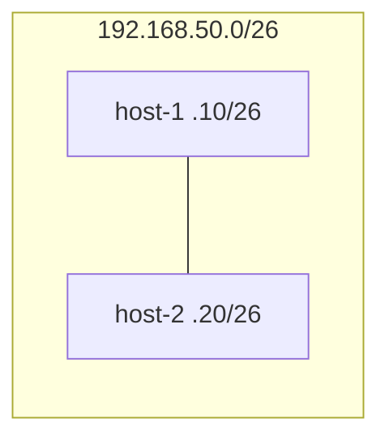

# Laboratorio M02-01 — CIDR y cálculo de subredes

[← Página anterior](../M01/M01-03-nat-pat.md) · [Siguiente página →](M02-02-puerta-enlace.md)

## Objetivo del laboratorio

Al terminar debes poder:

- Calcular red, broadcast y rango de hosts para un prefijo **CIDR** (p. ej. `/26`).
- Configurar una IP coherente con la subred en una interfaz y comprobarla con `ip`.
- Relacionar máscara, prefijo y número de direcciones útiles.

En cada paso: **levantar la maqueta** → **acceder al sistema** → comandos **dentro del sistema**.

Conceptos: [Glosario de términos](../../docs/glosario-terminos.md) (máscara/CIDR) · Comandos: [Glosario de herramientas](../../docs/glosario-herramientas.md).

---

## Mapa mental (antes de tocar comandos)

```text
Red 192.168.50.0/26  →  64 direcciones (2^6)
  ├── red:      192.168.50.0
  ├── hosts:    192.168.50.1 – 192.168.50.62
  └── broadcast: 192.168.50.63
```

- **Prefijo /26:** máscara `255.255.255.192` (6 bits de host).
- La maqueta ya asigna `host-1` y `host-2` dentro de ese bloque; tú verificas que encajan en el cálculo.

---

### Paso 1 — Calcular la subred en papel

**Aprende:** el **CIDR** une dirección de red y longitud del prefijo (`/26`). Todo host con la misma parte de red pertenece al mismo segmento L3.

**Haces:** sin levantar nada aún, completa la tabla para `192.168.50.0/26`:

| Campo | Valor |
|-------|-------|
| Máscara en puntos | |
| Dirección de red | |
| Primera IP usable | |
| Última IP usable | |
| Broadcast | |
| Nº de hosts útiles | |

**Deberías obtener:**

| Campo | Valor |
|-------|-------|
| Máscara | `255.255.255.192` |
| Red | `192.168.50.0` |
| Primera usable | `192.168.50.1` |
| Última usable | `192.168.50.62` |
| Broadcast | `192.168.50.63` |
| Hosts útiles | 62 |

**Por qué:** en `/26` quedan 6 bits para host → 2⁶ = 64 direcciones; se reservan red y broadcast.

---

### Paso 2 — Ver la subred en los sistemas

**Aprende:** `ip addr` muestra la IP y el prefijo que el sistema cree tener en cada interfaz.

#### Maqueta `compose/subredes` — qué levantas

| Qué aparece | Detalle |
|-------------|---------|
| **Sistemas** | `host-1` (`192.168.50.10/26`), `host-2` (`192.168.50.20/26`) |
| **Red** | Una subred `lan` → `192.168.50.0/26` (62 hosts útiles) |
| **Capa** | **L2/L3 mismo segmento** — ping directo, sin router |



**Levantar la maqueta:**

```bash
cd labs/M02/compose/subredes
docker compose up -d
```

**Acceder al sistema `host-1`:**

```bash
docker compose exec -it host-1 bash
```

**Dentro del sistema `host-1`:**

```bash
ip -4 addr show eth0
ip route show
```

**Deberías ver:** `192.168.50.10/26` en `eth0`.

**Repaso — leer la línea `inet`:** `192.168.50.10/26` confirma que este host está en la subred que calculaste en el paso 1: red `192.168.50.0`, máscara `/26`. El `/26` en la salida debe coincidir con tu tabla (si no, la IP estaría en otra subred lógica). Ver [M01-01 — `ip -4 addr show`](../M01/M01-01-tipos-redes-topologias.md) si necesitas repasar cada campo.

**Dentro del sistema:** `exit`

**Acceder al sistema `host-2`:**

```bash
docker compose exec -it host-2 bash
```

**Dentro del sistema `host-2`:**

```bash
ip -4 addr show eth0
```

**Deberías ver:** `192.168.50.20/26`.

**Por qué:** Docker IPAM asignó IPs del rango usable; el `/26` en la interfaz indica qué destinos considera “enlace directo” (misma subred).

**Dentro del sistema:** `exit`

---

### Paso 3 — Comunicación en la misma subred

**Aprende:** dos hosts en la **misma subred** se alcanzan por L2/L3 local sin gateway intermedio.

**Acceder al sistema `host-1`:**

```bash
docker compose exec -it host-1 bash
```

**Dentro del sistema `host-1`:**

```bash
ping -c 3 192.168.50.20
```

**Deberías ver:** respuestas desde `host-2`.

**Dentro del sistema `host-1`:**

```bash
ping -c 2 192.168.50.63
```

**Deberías ver:** sin respuesta útil (broadcast no debe contestar a ping en muchos stacks).

**Dentro del sistema:** `exit`

**En tu terminal (maqueta):** `docker compose down`

---

### Paso 4 — Ajustar IP manualmente (opcional)

**Aprende:** puedes fijar una IP con `ip addr add` si respetas la red y no chocas con otra asignación.

**Levantar la maqueta:** `docker compose up -d`

**Acceder al sistema `host-1`:**

```bash
docker compose exec -it host-1 bash
```

**Dentro del sistema `host-1`:**

```bash
ip addr add 192.168.50.15/26 dev eth0 label eth0:lab
ip -4 addr show dev eth0
ping -c 2 192.168.50.20
ip addr del 192.168.50.15/26 dev eth0
exit
```

**Deberías ver:** la IP secundaria aparece y el ping sigue funcionando.

**En tu terminal (maqueta):** `docker compose down`

---

## Antes de seguir

### Pon el foco en

| Idea | Recuerda |
|------|----------|
| Prefijo más largo (/26 vs /24) | Subred **más pequeña**, menos hosts |
| Red y broadcast | No se asignan a equipos |
| Misma subred | `ping` directo; distinta subred → hace falta **router** (M02-02) |

### Reto

**1. ¿Encaja otra IP?** — ¿Puede un host usar `192.168.50.70/26` en esta red? Justifica con tu tabla del paso 1.

<details>
<summary>Ver solución</summary>

No. `192.168.50.70` cae en el bloque siguiente: con máscara /26 el siguiente bloque empieza en `192.168.50.64` (red `192.168.50.64/26`). `.70` sería host de **otra** subred, no de `192.168.50.0/26`.

</details>

**2. Subred más pequeña** — Si necesitas solo **14 hosts útiles**, ¿qué prefijo CIDR elegirías como mínimo?

<details>
<summary>Ver solución</summary>

`/28`: 2⁴ = 16 direcciones → 14 hosts útiles (menos red y broadcast). Con `/27` tendrías 30 hosts (demasiado para “solo 14” si quieres el bloque mínimo que cumple ≥14).

</details>

**3. Tercer host en la maqueta** — Añade `host-3` con `192.168.50.30` en `docker-compose.yaml` y haz `ping` desde `host-1`.

<details>
<summary>Ver solución</summary>

En `labs/M02/compose/subredes/docker-compose.yaml`:

```yaml
  host-3:
    image: lab-host:local
    hostname: host-3
    networks:
      lan:
        ipv4_address: 192.168.50.30
```

**Levantar la maqueta:** `docker compose up -d`

**Acceder a `host-1`:** `docker compose exec -it host-1 bash`

**Dentro del sistema:**

```bash
ping -c 2 192.168.50.30
```

</details>
