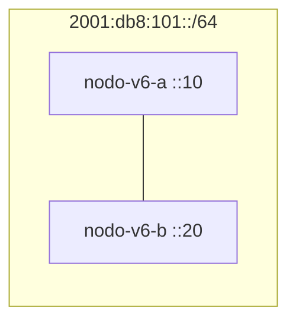

# Laboratorio M02-03 — IPv6 básico

[← Página anterior](M02-02-puerta-enlace.md) · [Siguiente página →](../M03/README.md)

## Objetivo del laboratorio

Al terminar debes poder:

- Asignar direcciones IPv6 de laboratorio y comprobarlas con `ip -6`.
- Hacer `ping -6` entre dos nodos en la misma red.
- Distinguir dirección **global/ULA de práctica** y **link-local** (`fe80::/10`).

En cada paso: **levantar la maqueta** → **acceder al sistema** → comandos **dentro del sistema**.

Conceptos: [Glosario de términos](../../docs/glosario-terminos.md) · Comandos: [Glosario de herramientas](../../docs/glosario-herramientas.md).

---

## Mapa mental (antes de tocar comandos)

```text
Misma LAN (10.60.1.0/24 en IPv4 de la maqueta)
  nodo-v6-a  →  2001:db8:101::10/64
  nodo-v6-b  →  2001:db8:101::20/64
  link-local →  fe80::/10 en cada interfaz (automático)
```

- `2001:db8::/32` es espacio de **documentación** (no producción en internet).
- **Link-local:** siempre presente en interfaces activas; alcance solo al enlace.

---

### Paso 1 — Levantar y montar IPv6

**Aprende:** en este laboratorio las direcciones globales de práctica las fija el compose (`::10` y `::20`); el script solo añade la ruta por defecto de ejercicio (no SLAAC del proveedor).

#### Maqueta `compose/ipv6` — qué levantas

| Qué aparece | Detalle |
|-------------|---------|
| **Sistemas** | `nodo-v6-a`, `nodo-v6-b` |
| **Red** | `lan-v6` — IPv4 `10.60.1.0/24` + IPv6 `2001:db8:101::/64` |
| **IPv6 fijas** | `nodo-v6-a` → `::10`, `nodo-v6-b` → `::20` |
| **Script** | `./montar-ipv6.sh` — ruta default IPv6 de práctica |



**Levantar la maqueta:**

```bash
cd labs/M02/compose/ipv6
docker compose up -d
./montar-ipv6.sh
```

**Acceder al sistema `nodo-v6-a`:**

```bash
docker compose exec -it nodo-v6-a bash
```

**Dentro del sistema `nodo-v6-a`:**

```bash
ip -6 addr show dev eth0
ip -6 route show
```

**Deberías ver:** `2001:db8:101::10/64` y una ruta default vía `2001:db8:101::1` (gateway ficticio del script).

**Dentro del sistema:** `exit`

---

### Paso 2 — Ping IPv6 entre nodos

**Aprende:** `ping -6` usa ICMPv6; en la misma `/64` el vecino directo es alcanzable como en IPv4 en una subred.

**Acceder al sistema `nodo-v6-a`:**

```bash
docker compose exec -it nodo-v6-a bash
```

**Dentro del sistema `nodo-v6-a`:**

```bash
ping -6 -c 3 2001:db8:101::20
```

**Deberías ver:** respuestas desde `nodo-v6-b`.

**Acceder al sistema `nodo-v6-b`:**

```bash
docker compose exec -it nodo-v6-b bash
```

**Dentro del sistema `nodo-v6-b`:**

```bash
ping -6 -c 3 2001:db8:101::10
```

**Deberías ver:** respuesta simétrica.

**Dentro del sistema:** `exit`

---

### Paso 3 — Link-local

**Aprende:** las direcciones `fe80::/10` identifican el vecino en el **mismo enlace**; suelen generarse solas (EUI-64 o establecidas por el kernel).

**Acceder al sistema `nodo-v6-a`:**

```bash
docker compose exec -it nodo-v6-a bash
```

**Dentro del sistema `nodo-v6-a`:**

```bash
ip -6 addr show dev eth0 | grep fe80
```

Anota la dirección link-local de `nodo-v6-a` (p. ej. `fe80::…`).

**Acceder al sistema `nodo-v6-b`:** obtén su `fe80::…` con el mismo comando.

**Dentro del sistema `nodo-v6-a`:**

```bash
ping -6 -c 2 fe80::<sufijo-de-b>%eth0
```

Sustituye por la link-local real de B; el `%eth0` indica la **zona** de interfaz (necesario cuando hay varias rutas link-local).

**Deberías ver:** respuesta usando solo direcciones de enlace.

**Por qué:** link-local no se enruta fuera de la interfaz; el `%eth0` evita ambigüedad si hay varias interfaces.

**Dentro del sistema:** `exit`

**En tu terminal (maqueta):** `docker compose down`

---

### Paso 4 — IPv4 en la misma maqueta (contexto)

**Aprende:** la red Docker sigue teniendo IPv4 (`10.60.1.x`); IPv6 convive en la misma interfaz (**dual stack**).

**Levantar la maqueta:** `up -d` y `./montar-ipv6.sh`

**Acceder al sistema `nodo-v6-a`:**

```bash
docker compose exec -it nodo-v6-a bash
```

**Dentro del sistema `nodo-v6-a`:**

```bash
ip -4 addr show eth0
ip -6 addr show eth0
exit
```

**Deberías ver:** `10.60.1.2/24` y `2001:db8:101::10/64` en `eth0`.

**En tu terminal (maqueta):** `docker compose down`

---

## Antes de seguir

### Pon el foco en

| Tipo IPv6 | Prefijo / ejemplo | Uso en este lab |
|-----------|-------------------|-----------------|
| Documentación | `2001:db8::/32` | Direcciones del script |
| Link-local | `fe80::/10` | Vecinos en el mismo enlace |
| Multicast | `ff00::/8` | No practicado aquí; aparece en teoría |

### Reto

**1. Prefijo más corto** — Si asignas `2001:db8:101::10/48` en lugar de `/64`, ¿sigue siendo habitual en redes reales? Busca en el glosario “IPv6”.

<details>
<summary>Ver solución</summary>

En redes reales la subred para enlaces suele ser **/64** (SLAAC, ND). Un `/48` en un host sería un prefijo de agregación, no lo típico en una interfaz de usuario final. En el lab mantén `/64` para imitar la práctica habitual.

</details>

**2. Ping solo link-local** — Desde `nodo-v6-a`, haz ping a la link-local de B **sin** usar la global `2001:db8:…`.

<details>
<summary>Ver solución</summary>

**Dentro de `nodo-v6-a`:**

```bash
ping -6 -c 2 fe80::<link-local-de-b>%eth0
```

</details>

**3. Tercer nodo** — Añade `nodo-v6-c` con `2001:db8:101::30/64` en el script y comprueba `ping -6` desde A.

<details>
<summary>Ver solución</summary>

Añade el servicio en `docker-compose.yaml` y una línea en `montar-ipv6.sh` análoga a las de A y B.

**Levantar:** `up -d`, `./montar-ipv6.sh`

**Dentro de `nodo-v6-a`:** `ping -6 -c 2 2001:db8:101::30`

</details>
