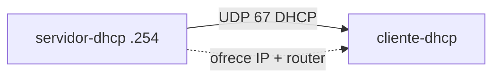

# Laboratorio M03-02 — DHCP

[← Página anterior](M03-01-dns.md) · [Siguiente página →](M03-03-ftp-sftp.md)

## Objetivo del laboratorio

Al terminar debes poder:

- Obtener dirección IPv4, máscara y **gateway** con `dhclient` en un cliente.
- Leer el rango y opciones DHCP del servidor (dnsmasq).
- Explicar qué ocurre si renuevas o liberas la concesión.

En cada paso: **levantar la maqueta** → **acceder al sistema** → comandos **dentro del sistema**.

Conceptos: [Glosario de términos](../../docs/glosario-terminos.md) · Comandos: [Glosario de herramientas](../../docs/glosario-herramientas.md).

---

## Mapa mental (antes de tocar comandos)

```text
servidor-dhcp (192.168.53.254)  ──oferta──►  cliente-dhcp
     rango: 192.168.53.100 – 150
     opción router: 192.168.53.254
```

---

## Apéndice — DHCP por dentro (ejemplo con Scapy)

**Opcional.** La maqueta del paso 1 usa **dnsmasq** (servidor real listo para producción). El script [`compose/dhcp/ejemplo-dhcp-scapy.py`](compose/dhcp/ejemplo-dhcp-scapy.py) hace lo mismo en miniatura: escucha un **DISCOVER** y responde con un **OFFER** construido capa a capa.

Así ves qué campos intervienen antes de usar `dhclient` en el laboratorio:

| Capa | En el OFFER del ejemplo | Para qué sirve |
|------|-------------------------|----------------|
| Ethernet | `dst=ff:ff:ff:ff:ff:ff` | El cliente aún no tiene IP; el frame va a broadcast |
| IP | `src=192.168.1.1`, `dst=255.255.255.255` | Mismo criterio a nivel L3 |
| UDP | `sport=67`, `dport=68` | Puertos estándar DHCP servidor/cliente |
| BOOTP | `yiaddr`, `siaddr`, `xid`, `chaddr` | IP ofrecida, servidor, ID de transacción, MAC |
| DHCP (opciones) | `message-type offer`, `router`, `subnet_mask`, `lease_time`… | Gateway, máscara, DNS, tiempo de concesión |

En la maqueta, esas opciones equivalen a líneas de `dnsmasq-dhcp.conf` (`dhcp-range`, `option:router`, etc.).

**No hace falta ejecutarlo** para completar el laboratorio. Si quieres probarlo en el Codespace (fuera del contenedor):

```bash
pip install scapy
cd labs/M03/compose/dhcp
sudo python3 ejemplo-dhcp-scapy.py
```

En otra terminal, un cliente en la misma LAN L2 podría hacer `dhclient eth0` y verías el DISCOVER/OFFER en la salida del script. El ejemplo usa la red `192.168.1.0/24` (didáctica); la maqueta del curso usa `192.168.53.0/24`.

<details>
<summary>Ver el flujo DORA completo frente al script</summary>

| Fase | Quién envía | Qué hace el ejemplo Scapy |
|------|-------------|---------------------------|
| **D**iscover | Cliente | Lo captura `sniff` y entra en `handle_dhcp` |
| **O**ffer | Servidor | Lo construye y envía con `sendp` |
| **R**equest | Cliente | No implementado (dnsmasq sí en la maqueta) |
| **A**ck | Servidor | No implementado (dnsmasq sí en la maqueta) |

El script enseña sobre todo la **O** del acrónimo **DORA** y el contenido de un OFFER.

</details>

---

### Paso 1 — Levantar y leer la configuración del servidor

**Aprende:** el servidor DHCP define **pool**, máscara y opciones (gateway, DNS, lease time).

#### Maqueta `compose/dhcp` — qué levantas

| Qué aparece | Detalle |
|-------------|---------|
| **Sistemas** | `servidor-dhcp` (dnsmasq), `cliente-dhcp` |
| **Red** | `lan-dhcp` → `192.168.53.0/24` |
| **Servidor** | `192.168.53.254` — pool `.100`–`.150`, gateway `.254` |
| **Cliente** | Sin IP fija; obtiene lease con `dhclient` |



**Levantar la maqueta:**

```bash
cd labs/M03/compose/dhcp
docker compose up -d
```

**En tu terminal (maqueta):** revisa el rango en `dnsmasq-dhcp.conf` (`dhcp-range`, `dhcp-option=option:router,…`).

**Acceder al sistema `cliente-dhcp`:**

```bash
docker compose exec -it cliente-dhcp bash
```

**Dentro del sistema `cliente-dhcp`:**

```bash
ip -4 addr show eth0
```

**Deberías ver:** puede haber una IP previa de Docker o ninguna fija útil; el cliente está listo para solicitar por DHCP.

---

### Paso 2 — Solicitar lease con dhclient

**Aprende:** `dhclient` envía **DISCOVER/OFFER/REQUEST/ACK** y configura la interfaz.

**Dentro del sistema `cliente-dhcp`:**

```bash
ip addr flush dev eth0
dhclient -v eth0
ip -4 addr show eth0
ip route show default
```

**Deberías ver:**

- Una IP entre `192.168.53.100` y `192.168.53.150`.
- Ruta `default via 192.168.53.254`.

**Por qué:** coincide con `dnsmasq-dhcp.conf` del servidor.

---

### Paso 3 — Comprobar reachability al gateway

**Aprende:** la opción **router** del DHCP es el default gateway que instala el cliente.

**Dentro del sistema `cliente-dhcp`:**

```bash
ping -c 3 192.168.53.254
```

**Deberías ver:** respuesta del `servidor-dhcp`.

**Dentro del sistema:** `exit`

**En tu terminal (maqueta):** `docker compose down`

---

### Paso 4 — Renovar y liberar (opcional)

**Aprende:** **renew** extiende la concesión; **release** la devuelve y quita la configuración.

**Levantar la maqueta:** `docker compose up -d`

**Acceder a `cliente-dhcp`:**

```bash
docker compose exec -it cliente-dhcp bash
```

**Dentro del sistema `cliente-dhcp`:**

```bash
dhclient -v eth0
dhclient -r eth0
ip -4 addr show eth0
dhclient -v eth0
exit
```

**Deberías ver:** tras `-r`, la IP puede desaparecer; al volver a solicitar, nueva concesión del pool.

**En tu terminal (maqueta):** `docker compose down`

---

## Antes de seguir

### Pon el foco en

| Fase DHCP | Qué ocurre |
|-----------|------------|
| DISCOVER | Cliente busca servidor |
| OFFER | Servidor propone IP y opciones |
| REQUEST | Cliente acepta |
| ACK | Servidor confirma lease |

### Reto

**1. Reserva fija** — En `dnsmasq-dhcp.conf` añade `dhcp-host=…,192.168.53.120` con la MAC de `cliente-dhcp` (`ip link show eth0`) y comprueba que siempre recibe `.120`.

<details>
<summary>Ver solución</summary>

Ejemplo (sustituye MAC real):

```text
dhcp-host=02:42:ac:35:00:02,192.168.53.120
```

Recrea `servidor-dhcp`, en el cliente: `dhclient -r eth0; dhclient eth0` y verifica `192.168.53.120`.

</details>

**2. Sin servidor** — Para el servicio `servidor-dhcp` y ejecuta `dhclient` en el cliente.

<details>
<summary>Ver solución</summary>

**En tu terminal:** `docker compose stop servidor-dhcp`

**Dentro de `cliente-dhcp`:** `dhclient -v eth0` debe quedarse esperando o fallar sin ACK.

Vuelve a levantar el servidor y repite.

</details>

**3. Lease time** — ¿Cuántas horas de lease define el fichero? (pista: último valor del `dhcp-range`).

<details>
<summary>Ver solución</summary>

`12h` en la línea `dhcp-range=…,12h`.

</details>
