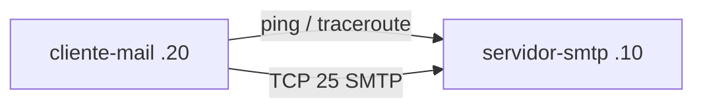

# Laboratorio M03-04 — SMTP e ICMP

[← Página anterior](M03-03-ftp-sftp.md) · [Siguiente página →](../M04/README.md)

## Objetivo del laboratorio

Al terminar debes poder:

- Comprobar que un servicio **SMTP** escucha en el puerto 25 con `nc`.
- Usar **ping** (ICMP echo) y **traceroute** para diagnóstico de conectividad.
- Relacionar puerto de aplicación (25) con prueba de capa de transporte.

En cada paso: **levantar la maqueta** → **acceder al sistema** → comandos **dentro del sistema**.

Conceptos: [Glosario de términos](../../docs/glosario-terminos.md) · Comandos: [Glosario de herramientas](../../docs/glosario-herramientas.md).

---

## Mapa mental (antes de tocar comandos)

```text
cliente-mail ──ping/traceroute──► servidor-smtp (192.168.55.10)
              ──TCP 25 (SMTP)────► postfix en escucha
```

- **ICMP** (ping): prueba si hay respuesta IP entre hosts (puede filtrarse en firewalls reales).
- **SMTP:** protocolo de correo; aquí solo comprobamos que el puerto acepta conexión.

---

### Paso 1 — Levantar la maqueta de correo

**Aprende:** el contenedor `boky/postfix` expone un MTA de laboratorio en la LAN `192.168.55.0/24`.

#### Maqueta `compose/correo` — qué levantas

| Qué aparece | Detalle |
|-------------|---------|
| **Sistemas** | `servidor-smtp` (imagen `boky/postfix`), `cliente-mail` |
| **Red** | `lan-mail` → `192.168.55.0/24` |
| **IPs** | Servidor `.10`, cliente `.20` |
| **Servicio** | SMTP en puerto **25** (arranque ~10–15 s) |



**Levantar la maqueta:**

```bash
cd labs/M03/compose/correo
docker compose up -d
```

Espera unos segundos a que postfix arranque.

**Acceder al sistema `cliente-mail`:**

```bash
docker compose exec -it cliente-mail bash
```

**Dentro del sistema `cliente-mail`:**

```bash
ping -c 3 192.168.55.10
```

**Deberías ver:** respuestas del servidor SMTP.

---

### Paso 2 — Puerto 25 con netcat

**Aprende:** `nc` abre una sesión TCP; si el puerto está abierto, verás banner SMTP o conexión establecida.

**Dentro del sistema `cliente-mail`:**

```bash
nc -vz 192.168.55.10 25
```

**Deberías ver:** `succeeded` o conexión abierta.

**Dentro del sistema `cliente-mail`:**

```bash
nc -w 3 192.168.55.10 25
```

Escribe (si aparece prompt del servidor):

```text
QUIT
```

**Deberías ver:** línea de bienvenida tipo `220` y cierre al `QUIT`.

---

### Paso 3 — Traceroute en la LAN

**Aprende:** en una misma subred el salto suele ser **directo** (un hop o respuesta inmediata).

**Dentro del sistema `cliente-mail`:**

```bash
traceroute -n 192.168.55.10
```

Si no está instalado:

```bash
tracepath -n 192.168.55.10
```

**Deberías ver:** un salto o latencia baja hacia `.10`.

**Por qué:** no hay routers intermedios entre `.20` y `.10` en esta maqueta.

**Dentro del sistema:** `exit`

---

### Paso 4 — Ping con tamaño de paquete (opcional)

**Aprende:** ICMP permite detectar problemas de **MTU** o filtrado con payloads mayores.

**Acceder al sistema `cliente-mail`:**

```bash
docker compose exec -it cliente-mail bash
```

**Dentro del sistema `cliente-mail`:**

```bash
ping -c 2 -s 1400 192.168.55.10
ping -c 2 192.168.55.99
```

**Deberías ver:** el primero OK; el segundo hacia IP inexistente falla (timeout o unreachable).

**Dentro del sistema:** `exit`

**En tu terminal (maqueta):** `docker compose down`

---

## Antes de seguir

### Pon el foco en

| Herramienta | Capa / uso |
|-------------|------------|
| `ping` | ICMP — ¿hay camino IP y respuesta? |
| `traceroute` | Rutas y retardos por salto |
| `nc` puerto 25 | TCP — ¿el servicio SMTP escucha? |

### Reto

**1. Puerto cerrado** — Prueba `nc -vz 192.168.55.10 9999` desde `cliente-mail`.

<details>
<summary>Ver solución</summary>

**Dentro de `cliente-mail`:**

```bash
nc -vz 192.168.55.10 9999
```

**Deberías ver:** connection refused o timeout (no hay servicio en 9999 en este compose).

</details>

**2. Banner SMTP** — Captura la primera línea `220` al conectar con `nc` y anota el nombre de host que anuncia.

<details>
<summary>Ver solución</summary>

```bash
nc -w 3 192.168.55.10 25
```

Primera línea suele empezar por `220` y contener `mail.lab.local` (según `HOSTNAME` del compose).

</details>

**3. Desde tu Codespace** — En tu **terminal del Codespace**, `ping -c 2 8.8.8.8` y `traceroute -n 8.8.8.8` (si está permitido). ¿Cuántos saltos ves hacia internet?

<details>
<summary>Ver solución</summary>

Depende del cloud; anota el número de hops y si algún salto muestra `*`. Compara con el lab de un solo salto en `192.168.55.10`.

</details>
