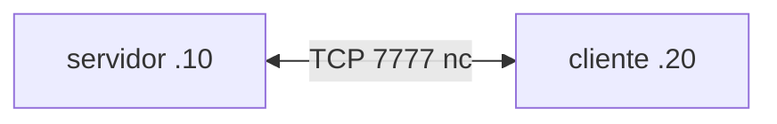

# Laboratorio M04-02 — Sockets y cliente-servidor

[← Página anterior](M04-01-tcp-udp-puertos.md) · [Siguiente página →](../M05/README.md)

## Objetivo del laboratorio

Al terminar debes poder:

- Montar un **servidor TCP** con `nc -l` y un **cliente** que se conecta.
- Explicar el par socket (IP origen:puerto ↔ IP destino:puerto).
- Ver la conexión con `ss` en ambos extremos.

En cada paso: **levantar la maqueta** → **acceder al sistema** → comandos **dentro del sistema** (dos sesiones para servidor y cliente).

Conceptos: [Glosario de términos](../../docs/glosario-terminos.md) · Comandos: [Glosario de herramientas](../../docs/glosario-herramientas.md).

---

## Mapa mental (antes de tocar comandos)

```text
servidor: nc -l -p 7777          (escucha)
cliente:  nc 192.168.56.10 7777   (conecta)
         ─────── flujo de texto bidireccional ───────
```

Un **socket** es el extremo de la comunicación (dirección + puerto + protocolo).

---

### Paso 1 — Levantar la maqueta

#### Maqueta `compose/servicios` — qué levantas

| Qué aparece | Detalle |
|-------------|---------|
| **Sistemas** | `servidor` y `cliente` en `192.168.56.0/24` |
| **Uso en este lab** | No usas los listeners del compose; tú lanzas `nc -l` a mano en el servidor |
| **Puerto práctica** | TCP **7777** — chat cliente-servidor |



**Levantar la maqueta:**

```bash
cd labs/M04/compose/servicios
docker compose up -d
```

Usarás `servidor` y `cliente` de la misma red `192.168.56.0/24`.

---

### Paso 2 — Servidor en escucha (TCP)

**Aprende:** el servidor debe **bind + listen** antes de que el cliente haga `connect`.

**Acceder al sistema `servidor`:**

```bash
docker compose exec -it servidor bash
```

**Dentro del sistema `servidor`:**

```bash
nc -l -p 7777
```

Deja la sesión **esperando** (no cierres).

---

### Paso 3 — Cliente conecta y envía texto

**Aprende:** al conectar, el kernel asigna un puerto **efímero** en el cliente.

**Acceder al sistema `cliente` (segunda terminal en la maqueta):**

```bash
docker compose exec -it cliente bash
```

**Dentro del sistema `cliente`:**

```bash
echo mensaje-desde-cliente | nc -w 2 192.168.56.10 7777
```

**Deberías ver:** en la sesión del **servidor**, el texto `mensaje-desde-cliente`.

**Dentro del sistema `servidor`:** escribe una respuesta manual (si `nc` lo permite) o cierra con Ctrl+C y repite con chat interactivo:

```bash
nc -l -p 7777
```

**Dentro del sistema `cliente`:**

```bash
nc 192.168.56.10 7777
```

Escribe `hola-socket`, Enter; en el servidor debería aparecer la línea.

---

### Paso 4 — Observar sockets con ss

**Aprende:** `ss -tn` muestra IPs, puertos y estado (`LISTEN`, `ESTAB`).

**Dentro del sistema `servidor` (con `nc -l` activo o tras conexión):**

```bash
ss -tn | grep 7777
```

**Dentro del sistema `cliente`:**

```bash
ss -tn | grep 7777
```

**Deberías ver:** en el servidor `LISTEN` en `:7777` y `ESTAB` hacia el cliente; en el cliente `ESTAB` hacia `192.168.56.10:7777`.

**Dentro de cada sistema:** `exit`

**En tu terminal (maqueta):** `docker compose down`

---

### Paso 5 — UDP “socket” sin conexión (opcional)

**Aprende:** en UDP no hay handshake; cada `sendto` es independiente.

**Acceder al sistema `servidor`:**

```bash
docker compose exec -it servidor bash
```

**Dentro del sistema `servidor`:**

```bash
nc -u -l -p 8888
```

**Acceder al sistema `cliente`:**

```bash
docker compose exec -it cliente bash
```

**Dentro del sistema `cliente`:**

```bash
echo udp-lab | nc -u -w 2 192.168.56.10 8888
```

**Deberías ver:** el datagrama en el servidor (si la sesión `nc -u -l` sigue abierta).

**Dentro del sistema:** `exit` en ambos.

**En tu terminal (maqueta):** `docker compose down`

---

## Antes de seguir

### Pon el foco en

| Rol | Comando típico | Estado en `ss` |
|-----|----------------|----------------|
| Servidor TCP | `nc -l -p PUERTO` | LISTEN |
| Cliente TCP | `nc IP PUERTO` | ESTAB |
| Socket | Par (proto, local, remoto) | Identifica la conversación |

### Reto

**1. Dos clientes seguidos** — Servidor `nc -l -p 7777`; conecta dos veces desde el cliente con mensajes distintos.

<details>
<summary>Ver solución</summary>

**Dentro de `servidor`:** `nc -l -p 7777`

**Dentro de `cliente`:**

```bash
echo uno | nc -w 2 192.168.56.10 7777
echo dos | nc -w 2 192.168.56.10 7777
```

Reinicia `nc -l` entre pruebas si el servidor cerró tras la primera conexión.

</details>

**2. Puerto en uso** — Intenta dos `nc -l -p 7777` en el mismo servidor.

<details>
<summary>Ver solución</summary>

El segundo debe fallar con “Address already in use”. Solo un proceso puede hacer bind al mismo puerto TCP.

</details>

**3. Relación con M04-01** — ¿En qué se parece `nc` al `curl` del puerto 8080 y en qué se diferencia?

<details>
<summary>Ver solución</summary>

Ambos usan **TCP** y sockets. `curl` habla el protocolo **HTTP** (peticiones formateadas); `nc` envía bytes en bruto sin semántica HTTP. El puerto 8080 en M04-01 ya tenía un servidor; aquí tú creas el servidor con `nc`.

</details>
