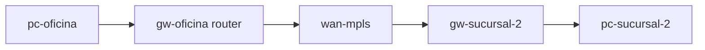

# Laboratorio M07-02 — Router, módem y access point

[← Página anterior](M07-01-switch-tabla-mac.md) · [Siguiente página →](M07-03-wifi-basico.md)

## Objetivo del laboratorio

Al terminar debes poder:

- Distinguir **módem**, **router** y **access point** por función (WAN vs LAN vs L2 inalámbrico).
- Identificar en la maqueta **empresa** qué sistemas actúan como gateway entre sedes.
- Explicar por qué hace falta **routing** entre subredes distintas.

Usarás la maqueta [../M01/compose/empresa](../M01/compose/empresa) (tres LAN + WAN simulada). En cada paso: **levantar** → **acceder** → comandos **dentro del sistema**.

---

### Paso 1 — Roles en la vida real (sin maqueta)

**Aprende:**

| Dispositivo | Capa principal | Función típica |
|-------------|----------------|----------------|
| **Módem** | 1–2 (enlace con ISP) | Convierte/señaliza el acceso del proveedor (fibra, DSL, cable) |
| **Router** | 3 | Enruta entre subredes; suele hacer NAT hacia internet |
| **Access point (AP)** | 2 (+ radio) | Conecta clientes WiFi al **mismo segmento L2** que el switch uplink |

**Haces:** anota en una frase qué compra tu router doméstico “todo en uno” (módem + router + AP + switch).

**Por qué:** en laboratorio Linux simulas **router** con `ip_forward` y rutas; el AP físico no aparece hasta M07-03.

---

### Paso 2 — Gateways en la maqueta empresa

**Aprende:** cada sede tiene un **gw-*** con una IP hacia la LAN local y otra hacia la WAN `10.255.0.0/24`.

#### Maqueta `compose/empresa` (M01) — qué levantas

| Qué aparece | Detalle |
|-------------|---------|
| **Rol router** | Cada `gw-*` enruta entre su LAN y `wan-mpls` |
| **LANs** | Oficina `192.168.10.0/24`, sucursales `.20` y `.30` |
| **WAN** | `10.255.0.0/24` — transporte entre gateways |
| **Script** | `./montar-rutas.sh` |



**Levantar la maqueta:**

```bash
cd labs/M01/compose/empresa
docker compose up -d
./montar-rutas.sh
```

**Acceder al sistema `gw-oficina`:**

```bash
docker compose exec -it gw-oficina bash
```

**Dentro del sistema `gw-oficina`:**

```bash
ip -4 addr show
ip route show
cat /proc/sys/net/ipv4/ip_forward
```

**Deberías ver:**

- Dos interfaces con IP: `192.168.10.254` y `10.255.0.11`.
- Rutas hacia `192.168.20.0/24` y `192.168.30.0/24` vía la WAN simulada.
- `ip_forward` = **1**.

**Por qué:** ese host es el **router** de la oficina: une la LAN de oficina con el “MPLS” de la maqueta. El módem real estaría del lado WAN del primer router; aquí la WAN ya es una red IP.

**Dentro del sistema:** `exit`

---

### Paso 3 — PC en sede A llega a sede B

**Aprende:** sin router, `192.168.10.x` no alcanza `192.168.20.x` (subredes distintas).

**Acceder al sistema `pc-oficina`:**

```bash
docker compose exec -it pc-oficina bash
```

**Dentro del sistema `pc-oficina`:**

```bash
ip route show default
ping -c 2 192.168.20.10
traceroute -n -m 5 192.168.20.10 2>/dev/null || ping -c 1 192.168.20.10
```

**Deberías ver:**

- Ruta por defecto vía `192.168.10.254`.
- `ping` con respuesta desde `pc-sucursal-1`.
- `traceroute` (si está instalado) muestra saltos por `10.255.0.x`.

**Por qué:** cada paquete cruza **dos routers** (oficina y sucursal 1) en la WAN simulada — comportamiento de **router**, no de switch.

**Dentro del sistema:** `exit`

---

### Paso 4 — Dónde pondrías un AP

**Aprende:** un AP no cambia la subred IP por sí solo; extiende el L2 (misma VLAN o misma LAN).

**Haces (reflexión):** en el diagrama mental de `empresa`, ¿en qué LAN conectarías un AP para que los portátiles obtengan `192.168.10.x`?

**Deberías concluir:** en `lan-oficina`, detrás del switch de esa sede; el gateway sigue siendo `192.168.10.254`. El AP **no sustituye** al router hacia otras sedes.

**Por qué:** confundir AP con router es frecuente en soporte: el AP une WiFi al switch; el router une subredes.

**En tu terminal (maqueta):** `docker compose down`

---

## Antes de seguir

### Pon el foco en

- **Una interfaz, un dominio L3** en cada lado del router (salvo subinterfaces/VLAN).
- **WAN** en la maqueta = red entre gateways, no internet pública real.
- El kit “router WiFi” hace NAT en la función router, no en el chip WiFi.

### Reto

**1. Ruta manual** — En `pc-sucursal-2`, borra la ruta por defecto y añade solo una ruta host hacia `192.168.10.10` vía `192.168.30.254`. Comprueba el ping.

<details>
<summary>Ver solución</summary>

**Dentro de `pc-sucursal-2`:**

```bash
ip route del default
ip route add 192.168.10.10 via 192.168.30.254
ping -c 2 192.168.10.10
```

Solo ese host /32 es alcanzable sin default completo.

</details>

**2. Etiquetar sistemas** — Clasifica `gw-sucursal-1`, `pc-oficina` y la red `wan-mpls` como “switch”, “router”, “PC” o “enlace WAN”.

<details>
<summary>Ver solución</summary>

`gw-*` = router L3. `pc-*` = host final. `wan-mpls` = enlace entre routers (WAN simulada), no un PC usuario.

</details>
