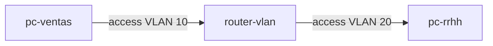

# Laboratorio M08-02 — Puertos access y trunk

[← Página anterior](M08-01-concepto-vlan.md) · [Siguiente página →](M08-03-casos-practicos.md)

## Objetivo del laboratorio

Al terminar debes poder:

- Diferenciar puerto **access** (una VLAN nativa) de **trunk** (varias VLAN con etiqueta 802.1Q).
- Explicar cómo la maqueta `departamentos` modela dos VLAN con un **router central**.
- Documentar el camino L3 ventas → RRHH tras `./montar-rutas.sh`.

En cada paso combina **concepto** (tabla) con **práctica** en la maqueta.

---

### Paso 1 — Access vs trunk (tabla)

**Aprende:**

| Tipo puerto | VLANs que transporta | Etiqueta 802.1Q | Uso típico |
|-------------|----------------------|-----------------|------------|
| **Access** | Una (PVID) | No en el usuario final | PC, impresora, AP en SSID mapeado a VLAN |
| **Trunk** | Varias | Sí entre switches/routers | Enlace switch ↔ switch o switch ↔ router |

**Haces:** completa con tu palabras: “El PC de ventas se conecta a un puerto …; el enlace entre switch de planta y router es …”.

**Deberías ver:** access hacia hosts; trunk hacia `router-vlan` que participa en varias VLAN.

**Por qué:** sin trunk, necesitarías un cable físico por VLAN hasta el router — inviable en edificios grandes.

---

### Paso 2 — Modelo mental de la maqueta departamentos

**Aprende:** Docker crea dos redes = dos broadcast domains. `router-vlan` tiene dos interfaces (como subinterfaces VLAN terminadas en el router).

#### Maqueta `compose/departamentos` — qué levantas (con routing)

| Qué aparece | Detalle |
|-------------|---------|
| **Sistemas** | `pc-ventas`, `pc-rrhh`, `router-vlan` |
| **Trunk lógico** | `router-vlan` con patas en **dos** VLAN (dos redes Docker) |
| **Script** | `./montar-rutas.sh` — default gateway en PCs + `ip_forward` en router |
| **Resultado** | Tráfico ventas → RRHH sale por `10.80.10.254` |



**Levantar la maqueta:**

```bash
cd labs/M08/compose/departamentos
docker compose up -d
./montar-rutas.sh
```

**Acceder al sistema `router-vlan`:**

```bash
docker compose exec -it router-vlan bash
```

**Dentro del sistema `router-vlan`:**

```bash
ip -4 addr show
ip route show
iptables -L FORWARD -n 2>/dev/null | head -3 || true
```

**Deberías ver:**

- `10.80.10.254` y `10.80.20.254` en interfaces distintas.
- Rutas conectadas hacia `10.80.10.0/24` y `10.80.20.0/24`.

**Por qué:** equivale a **router-on-a-stick**: una sola “caja” con patas en cada VLAN.

**Dentro del sistema:** `exit`

---

### Paso 3 — Tráfico ventas → RRHH

**Acceder al sistema `pc-ventas`:**

```bash
docker compose exec -it pc-ventas bash
```

**Dentro del sistema `pc-ventas`:**

```bash
ip route get 10.80.20.10
ping -c 2 pc-rrhh
```

**Deberías ver:**

- `ip route get` indica salida por `10.80.10.254`.
- `ping` por nombre si resuelve `pc-rrhh` a `10.80.20.10`.

**Por qué:** el frame sale sin etiqueta en access ventas; el router recibe en la interfaz ventas y reenvía por la interfaz RRHH (conceptualmente trunk interno del hipervisor).

**Dentro del sistema:** `exit`

---

### Paso 4 — Política entre departamentos (concepto)

**Aprende:** en producción, no todo tráfico inter-VLAN debería estar permitido (ACL en router o firewall).

**Haces:** enumera tres servicios que dejarías solo de ventas→RRHH y cuáles bloquearías.

**Deberías ver:** ejemplos — permitir ERP interno TCP 443; bloquear SMB de ventas a RRHH; registrar intentos.

**Por qué:** VLAN aísla broadcast, **no** sustituye firewall; M05 ya viste filtrado L3/L4.

**En tu terminal (maqueta):** `docker compose down`

---

## Antes de seguir

### Pon el foco en

- **802.1Q** = campo VLAN ID en trama Ethernet en trunks.
- **PVID** en access = VLAN nativa del puerto.
- Router (o L3 switch) es obligatorio para comunicación **entre** VLAN IDs distintos.

### Reto

**1. Etiqueta en papel** — Si ventas = VLAN 10 y RRHH = VLAN 20, escribe cómo se vería una trama en trunk (ID 20) vs en access hacia PC (sin etiqueta, PVID 20).

<details>
<summary>Ver solución</summary>

Trunk: Ethernet con 802.1Q tag VLAN 20. Access usuario: sin tag, switch asocia puerto a VLAN 20 por configuración PVID.

</details>

**2. Tercera subred** — Sin montar aún el compose, describe qué habría que añadir para una VLAN “voz” (red `10.80.30.0/24`) en el mismo router.

<details>
<summary>Ver solución</summary>

Nueva red en compose, interfaz en `router-vlan` con `.254`, rutas en PCs y script de montaje; trunk conceptual llevaría VLAN 30 además de 10 y 20.

</details>
